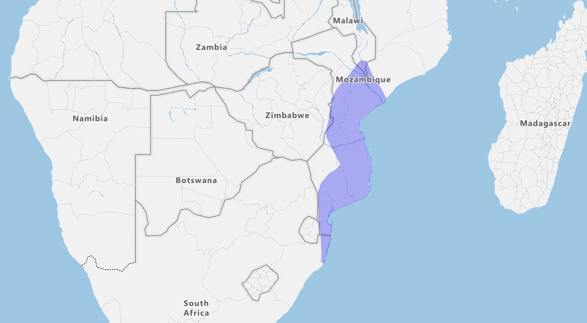

# GeoBirds

Open source project to create an freely accessible and editable resources for bird distributions globally.

## Why Open Source?

Open source means anyone can use the data and contribute to the project. The data is free to be used for any purpose commercial or non-commercial, our only ask is that you acknowledge the project and link to it.



## Initial Setup Steps

- [x] Test project structure and data structures
- [ ] Create masterlist using lastest IOC(add additional lists later)
- [ ] Create complete genus dataset(s) to serves a template for the project
- [ ] Create tools to allow for more efficient creating and editing of data
- [ ] Improve documentation
- [ ] Test branch protection

## Introduction

## File Structure

```
|- data
| |- distributions
| | |- order1
| | | |- family1
| | | | |- genus1
| | | | | |- genus1_species1.geojson
| | | | | |- genus1_species2.geojson
| | |- passeriformes
| | | |- platysteridae
| | | | |- batis
| | | | | |- batis_fratrum.geojson
```

Please note it is possible to search for an individual species by clicking "Go to file" at the top of the repo home page.

## Contributing

If you are interested contributing to the project and have any question please do not hesitate to contact any of the contributors for assistance.

The project uses GeoJSON as it core data structure. GeoJSON is simple, human-readable and well supported data format (by GIS software and web applications).

For simple distribution maps [geojson.io](https://geojson.io) is good resource. It is an online GeoJSON editor. It help you create GeoJSON files which can then be downloaded and added into the project file structure.

For more advanced and complex maps, GIS software may by needed. [QGIS](https://www.qgis.org/) is an amazing free GIS package.

## Feedback

## Resources

1. [IOC World Bird List](https://www.worldbirdnames.org/)
2. [SABAP2](resources/sabap2/sabap2.md)

## Licence
